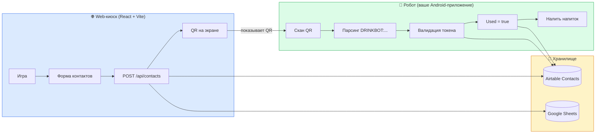
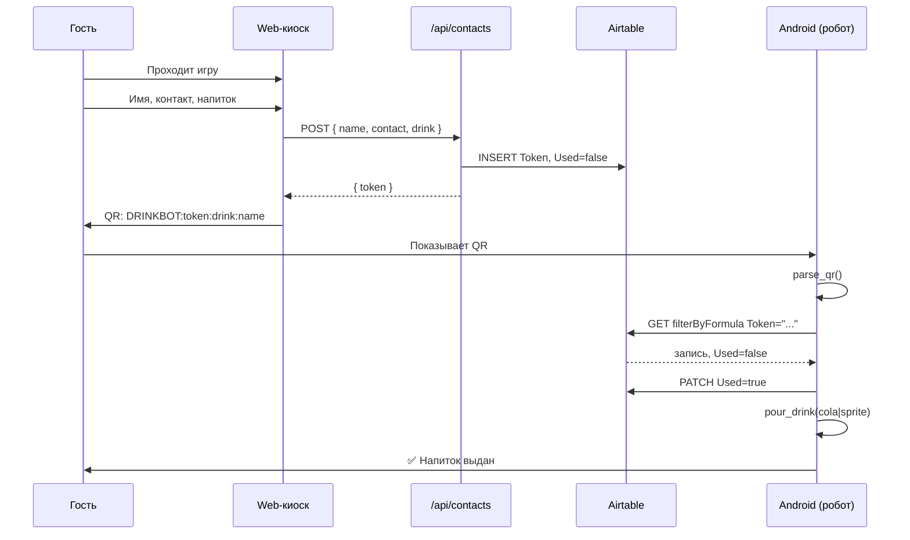
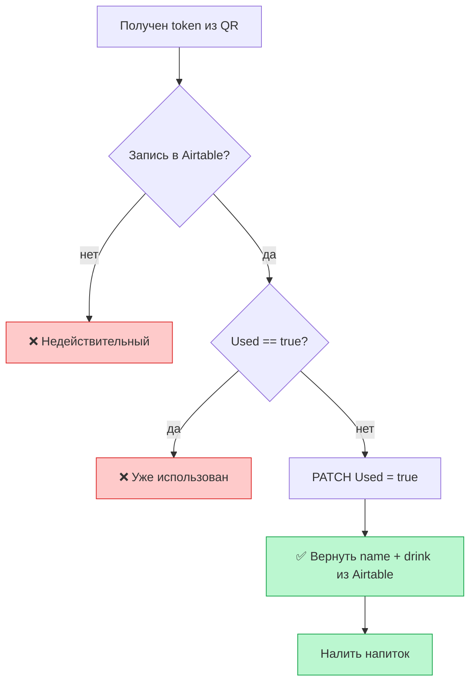

# Drink Booth — руководство для Android-разработчика

Документ описывает текущий проект и задачу: **Android-приложение на стенде робота**, которое сканирует QR-код формата `DRINKBOT:{token}:{drink}:{name}`, проверяет токен и запускает выдачу напитка.

---

## Что это за проект

**Drink Booth** — интерактивный стенд на мероприятии (хакатон [rusindustrial.ai](https://hackathon.rusindustrial.ai)):

1. Гость играет в браузере на планшете/киоске: программирует «снегоуборщика» из блоков.
2. После победы вводит имя, контакт и выбирает напиток.
3. Сервер сохраняет данные и выдаёт **уникальный токен**.
4. На экране показывается **QR-код** с токеном, напитком и именем.
5. Гость подносит QR к **роботу** — сканер считывает код, проверяет токен, робот наливает напиток.



---

## Репозиторий: что уже есть

| Часть | Технологии | Назначение |
|-------|------------|------------|
| `src/` | React 19, Vite | Веб-киоск: игра → форма → QR |
| `api/contacts.js` | Vercel Serverless | **Создание** записи и токена (только POST) |
| `robot/validate_qr.py` | Python, OpenCV, pyzbar | **Эталонная логика** сканирования и валидации для ПК/RPi |
| Airtable | REST API | Единый источник правды для токенов |
| Google Sheets | Apps Script | Дублирование контактов + настройки стенда |

**Важно:** отдельного HTTP API для **проверки/списания** QR-кода нет. Сейчас робот (Python-скрипт) ходит **напрямую в Airtable**. Android-приложение должно повторить эту логику (или команда бэкенда позже добавит `/api/validate` — см. раздел «Рекомендации»).

---

## Пользовательский сценарий (happy path)



---

## Формат QR-кода

### Актуальный формат (генерируется в `src/components/QRScreen.jsx`)

```
DRINKBOT:{token}:{drink_urlencoded}:{name_urlencoded}
```

**Пример (до кодирования):**
```
DRINKBOT:V1StGXR8_Z5j:Кофе ☕:Алексей
```

**Пример (в QR, percent-encoding):**
```
DRINKBOT:V1StGXR8_Z5j:%D0%9A%D0%BE%D1%84%D0%B5%20%E2%98%95:%D0%90%D0%BB%D0%B5%D0%BA%D1%81%D0%B5%D0%B9
```

### Поля

| Поле | Описание | Пример |
|------|----------|--------|
| `token` | Уникальный одноразовый код, `nanoid(12)` | `V1StGXR8_Z5j` |
| `drink` | **Человекочитаемая подпись** напитка (не id!), URL-encoded | `Кофе ☕` |
| `name` | Имя гостя, URL-encoded | `Алексей` |

### Обратная совместимость (старые QR)

Поддерживаются упрощённые варианты (см. `robot/validate_qr.py`):

```
DRINKBOT:{token}:{drink}     — без имени, drink без encoding (латиница)
DRINKBOT:{token}             — только токен
```

### Парсинг (портировать на Kotlin)

```kotlin
data class QrPayload(
    val token: String,
    val drink: String? = null,  // уже декодированный
    val name: String? = null,
)

fun parseQr(data: String): QrPayload? {
    if (!data.startsWith("DRINKBOT:")) return null
    val rest = data.removePrefix("DRINKBOT:")
    val parts = rest.split(":", limit = 3)
    val token = parts.getOrNull(0) ?: return null
    val drinkEnc = parts.getOrNull(1)
    val nameEnc = parts.getOrNull(2)
    return QrPayload(
        token = token,
        drink = drinkEnc?.let { URLDecoder.decode(it, "UTF-8") },
        name = nameEnc?.let { URLDecoder.decode(it, "UTF-8") },
    )
}
```

**Почему encoding:** в подписи напитка и имени могут быть кириллица, пробелы, emoji (`☕`). Разделитель полей — `:`, поэтому drink и name кодируются через `encodeURIComponent` / percent-encoding.

---

## Схема Airtable (таблица `Contacts`)

| Поле | Тип | Описание |
|------|-----|----------|
| `Name` | Text | Имя гостя |
| `Contact` | Text | Телефон или email |
| `Drink` | Text | **Id напитка** (`cola`, `sprite`) — не русская подпись |
| `Token` | Text | Одноразовый токен |
| `Used` | Checkbox | `false` при создании, `true` после выдачи |
| `CreatedAt` | Text/Date | ISO timestamp |

Создание записи — только через веб:

```http
POST /api/contacts
Content-Type: application/json

{
  "name": "Алексей",
  "contact": "+79991234567",
  "drink": "cola"
}
```

Ответ:
```json
{ "token": "V1StGXR8_Z5j" }
```

---

## Логика валидации (обязательно для Android)

Эталон: `robot/validate_qr.py` → функции `parse_qr()` и `validate_and_consume()`.

### Алгоритм `validate_and_consume(token)`



### Airtable REST API

**Base URL:**
```
https://api.airtable.com/v0/{AIRTABLE_BASE_ID}/{AIRTABLE_TABLE}
```

**Поиск по токену:**
```http
GET /v0/{baseId}/Contacts?filterByFormula=Token="{token}"
Authorization: Bearer {AIRTABLE_API_KEY}
```

Экранируй `"` и `\` в токене перед подстановкой в formula (как в Python).

**Списание токена:**
```http
PATCH /v0/{baseId}/Contacts/{recordId}
Authorization: Bearer {AIRTABLE_API_KEY}
Content-Type: application/json

{
  "fields": { "Used": true }
}
```

### Какой drink использовать для налива

Приоритет (как в Python):

1. **`Drink` из Airtable** — канонический id: `cola`, `sprite`
2. Fallback: **`drink` из QR** — человекочитаемая строка (`Добрый cola` и т.д.); потребуется маппинг label → id, если Airtable недоступен только для поля drink (но запись всё равно должна быть найдена по token)

Имя для UI:
```text
name = airtable.Name ?: qr.name ?: "гость"
```

---

## Напитки и железо

### Id напитков (в Airtable и для GPIO)

| id | Подпись в QR (пример) | GPIO pin (RPi, из Python) |
|----|------------------------|---------------------------|
| `cola` | `Добрый cola` | 17 |
| `sprite` | `Добрый лимон-лайм` | 18 |

Список напитков и картинки банок: `src/lib/gameLogic.js` → `DRINKS`. Подписи для отображения можно подтянуть из Google Apps Script (`loadSettings`), но **id** и **лимиты блоков** задаются кодом.

### Налив (`pour_drink`)

В Python — импульс на GPIO ~3 секунды. На Android зависит от вашего железа:

- USB/serial к контроллеру реле
- Bluetooth
- Локальный HTTP на Raspberry Pi
- GPIO через root / vendor SDK

**Задача Android-приложения:** после успешной валидации вызвать аналог `pour_drink(drinkId)`.

---

## Что делает Android-приложение (scope)

### MVP — must have

1. **Сканирование QR** камерой (CameraX + ML Kit / ZXing).
2. **Парсинг** строки `DRINKBOT:...` с URL-decode.
3. **Валидация** токена через Airtable (find + check `Used` + patch).
4. **UI состояний:**
   - сканирование / ожидание
   - проверка...
   - ✅ «Привет, {name}! Наливаем {drink}»
   - ❌ «Код недействителен или уже использован»
   - ⚠️ «Нет сети / Airtable недоступен»
5. **Команда на налип** по id напитка.
6. **Автоповтор** — после выдачи снова ждать следующий QR (как цикл в `validate_qr.py`).

### Nice to have

- Звук/анимация успеха и ошибки
- Лог локальных сканов (offline queue — **осторожно**, токен одноразовый)
- Kiosk mode (immersive, блокировка выхода)
- Настройки через экран админа (Base ID, API key — лучше не хардкодить в APK)

### Не входит в scope Android

- Игра, форма контактов, генерация QR — это веб (`src/`).
- Создание токенов — только `POST /api/contacts` с киоска.

---

## Конфигурация (env)

Для робота/Android нужны те же переменные, что в `robot/.env.example`:

```env
AIRTABLE_BASE_ID=appXXXXXXXXXXXXXX
AIRTABLE_API_KEY=patXXXXXXXXXXXXXXXX
AIRTABLE_TABLE=Contacts
```

**Безопасность:** Airtable Personal Access Token в APK — риск. Для продакшена лучше прокси-эндпоинт на сервере (см. ниже).

Веб-киоск использует дополнительно (Android не нужны для сканирования):

```env
GOOGLE_SCRIPT_URL=...        # дублирование в Sheets + config стенда
VITE_GOOGLE_SCRIPT_URL=...   # загрузка drinks/levels в браузере
```

---

## Рекомендации по архитектуре Android

### Вариант A — как сейчас (прямой Airtable)

Плюсы: быстро, 1:1 с `validate_qr.py`.  
Минусы: API key в приложении, сложнее ротация ключей.

### Вариант B — серверный `/api/validate` (предпочтительно)

Добавить на Vercel эндпоинт:

```http
POST /api/validate
{ "token": "V1StGXR8_Z5j" }

→ 200 { "name": "...", "drink": "cola", "consumed": true }
→ 404 / 409 если invalid / used
```

Android тогда не хранит Airtable credentials. Логику можно скопировать из `validate_and_consume()` в Python.

---

## Ссылки на код в репозитории

| Задача | Файл |
|--------|------|
| Генерация QR | `src/components/QRScreen.jsx` |
| Создание токена | `api/contacts.js` |
| Парсинг + валидация + GPIO | `robot/validate_qr.py` |
| Id напитков | `src/lib/gameLogic.js` → `DRINKS` |
| Форма (какие поля уходят на сервер) | `src/components/ContactForm.jsx` |

---

## Чеклист приёмки

- [ ] Сканируется QR с кириллицей и emoji в drink/name
- [ ] Первое сканирование валидного токена → напиток, `Used=true` в Airtable
- [ ] Повторное сканирование того же QR → отказ
- [ ] Несуществующий токен → отказ
- [ ] Нет интернета → понятная ошибка, напиток **не** выдаётся
- [ ] После успеха/ошибки приложение снова готово к скану
- [ ] Drink id из Airtable корректно мапится на ваш дозатор

---

## Контекст мероприятия

- Сайт стенда/робота: [hackathon.rusindustrial.ai](https://hackathon.rusindustrial.ai) (ссылка из QR-экрана веб-приложения)
- Деплой веб-части: Vercel (`vercel.json`, build → `dist/`)
- Токен: 12 символов, алфавит nanoid (URL-safe)

---

*Документ актуален для состояния репозитория drink-booth. Эталон поведения робота — `robot/validate_qr.py`.*
